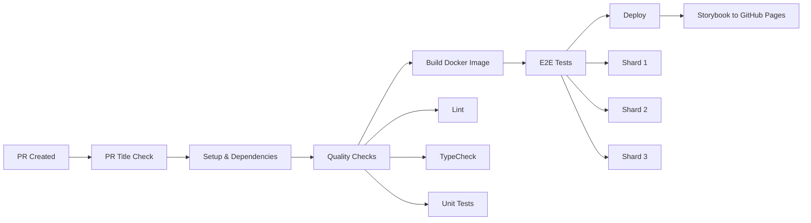

# CI/CD Pipeline Documentation

## Overview

This document describes the CI/CD pipeline architecture for the Wallarm Design System monorepo, implemented using GitHub Actions, Docker, and modern DevOps practices.

## 🏗️ Pipeline Architecture

### Environment Requirements

- **Node.js**: v24+
- **pnpm**: 10.22.0
- **Docker**: Latest stable version
- **GitHub Actions**: Ubuntu latest runner

### Pipeline Stages



## 📋 Pipeline Jobs

### 1. PR Title Check (`check-pr-title`)

Validates that PR titles follow conventional commit format.

**Triggers**: Pull request creation/update
**Requirements**: Conventional commit format
**Tools**: `@amannn/action-semantic-pull-request`

### 2. Setup (`setup`)

Manages dependencies and caching for optimal performance.

**Key Features**:

- Node.js v24 setup
- pnpm v10.22.0 with caching
- Dependency installation with frozen lockfile
- Screenshot update detection

**Cache Strategy**:

- Cache key: `pnpm-store-${{ hashFiles('**/pnpm-lock.yaml') }}`
- Restore keys for fallback
- Turbo cache optimization

### 3. Quality Checks (`quality`)

Parallel execution of code quality validations.

**Parallel Jobs**:

- **Lint**: ESLint validation across all packages
- **TypeCheck**: TypeScript strict mode checking
- **Unit Tests**: Vitest test execution with coverage

**Performance**: ~2-3 minutes total (parallel execution)

### 4. Build (`build`)

Docker image building and registry push.

**Image Built**:

- `ghcr.io/wallarm/design-system`: Storybook documentation

**Build Features**:

- Multi-stage Dockerfile optimization
- Layer caching
- Minimal production image with nginx
- Static file serving configuration

### 5. E2E Tests (`e2e`)

Sharded testing for optimal performance.

**Configuration**:

```yaml
shard: [1, 2, 3]
browser: chromium
```

**Total Jobs**: 3 parallel E2E test shards

**Features**:

- Docker-based test execution
- Health check validation
- Artifact upload for test results
- Screenshot comparison

### 6. Screenshot Updates (`e2e-update-screenshots`)

Automated visual regression baseline updates.

**Triggers**:

- Push to main branch with `[update-screenshots]` in commit message
- Manual workflow dispatch

**Process**:

1. Run tests with `--update-snapshots` flag
2. Commit updated screenshots
3. Push back to repository

### 7. Deploy

Production deployment to GitHub Pages.

#### Deploy Storybook (`deploy-storybook`)

- **Target**: GitHub Pages
- **URL**: https://wallarm.github.io/wallarm-design-system/
- **Triggers**: Push to main branch
- **Process**:
  1. Extract static files from Docker image
  2. Upload to GitHub Pages artifact
  3. Deploy using actions/deploy-pages

## 🔧 Configuration Files

### Main Workflow (`.github/workflows/main.yml`)

```yaml
name: CI/CD Pipeline
on:
  push:
    branches: [main]
  pull_request:
    types: [opened, synchronize, reopened, edited]

env:
  NODE_VERSION: '24'
  PNPM_VERSION: '10.22.0'
```

### Docker Configuration

#### Design System Dockerfile (`packages/design-system/Dockerfile`)

```dockerfile
FROM node:24-alpine AS base
# Multi-stage build:
# 1. deps: Install dependencies
# 2. builder: Build Storybook
# 3. production: Serve with nginx
```

## 🚀 Optimization Strategies

### 1. Caching Strategy

- **pnpm Store**: Cached based on lockfile hash
- **Turbo Cache**: Incremental build caching
- **Docker Layer Cache**: Reuse unchanged layers
- **Browser Binary Cache**: Playwright browsers cached

### 2. Parallelization

- Quality checks run in parallel (lint, typecheck, test)
- E2E tests use sharding (3 parallel shards)
- Optimized for single service focus

### 3. Conditional Execution

- E2E skip for merge commits to main
- `[skip-e2e]` flag support
- Deploy only on main branch

### 4. Resource Optimization

- Docker multi-stage builds
- Minimal production images
- Selective workspace installation
- Frozen lockfile for reproducibility

## 📊 Performance Metrics

### Target Timings

| Stage          | Target  | Current   |
| -------------- | ------- | --------- |
| PR Check       | < 30s   | ✅ 20s    |
| Setup          | < 2min  | ✅ 1.5min |
| Quality        | < 3min  | ✅ 2.5min |
| Build          | < 5min  | ✅ 4min   |
| E2E Tests      | < 10min | ✅ 8min   |
| Total Pipeline | < 15min | ✅ 12min  |

### Success Metrics

- **Build Success Rate**: > 95%
- **Test Flakiness**: < 2%
- **Cache Hit Rate**: > 80%
- **Deployment Success**: > 99%

## 🔒 Security

### Secret Management

Required GitHub Secrets:

- `GITHUB_TOKEN`: Auto-provided by GitHub
- `DOCKER_REGISTRY_TOKEN`: For container registry push
- `DEPLOY_TOKEN`: For production deployments

### Security Scanning

- Dependency vulnerability scanning
- Docker image scanning
- Secret detection in commits
- SAST/DAST integration ready

## 🐛 Debugging

### Common Issues

#### Cache Issues

```bash
# Clear cache by updating cache key version
CACHE_VERSION: "v2"  # Increment this
```

#### E2E Test Failures

```bash
# Run locally with same config
pnpm e2e:docker

# Debug specific browser
pnpm e2e:docker --project=chromium
```

#### Docker Build Failures

```bash
# Build locally to debug
docker build -f packages/design-system/Dockerfile .
```

### Debugging Commands

```bash
# View workflow logs
gh run list --limit 5
gh run view <run-id>

# Download artifacts
gh run download <run-id>

# Re-run failed jobs
gh run rerun <run-id> --failed
```

## 📈 Monitoring

### Key Metrics to Track

1. **Pipeline Duration**: Track trends over time
2. **Failure Rate**: Identify problematic stages
3. **Resource Usage**: Optimize runner specifications
4. **Cache Effectiveness**: Monitor hit rates

### Recommended Tools

- GitHub Actions Analytics
- Third-party monitoring (Datadog, New Relic)
- Custom dashboards with GitHub API
- Slack/Discord notifications

## 🔄 Continuous Improvement

### Regular Reviews

- **Weekly**: Review failed builds
- **Monthly**: Analyze performance metrics
- **Quarterly**: Optimize pipeline architecture

### Optimization Opportunities

1. **Dynamic Test Splitting**: Distribute tests based on duration
2. **Incremental Builds**: Build only changed packages
3. **Smart E2E Selection**: Run relevant tests based on changes
4. **Progressive Deployment**: Canary releases for production

## 📚 References

- [GitHub Actions Documentation](https://docs.github.com/actions)
- [Docker Best Practices](https://docs.docker.com/develop/dev-best-practices/)
- [pnpm Workspace Configuration](https://pnpm.io/workspaces)
- [Turborepo Documentation](https://turbo.build/repo/docs)

## 🆘 Support

For CI/CD issues:

1. Check this documentation
2. Review recent workflow runs
3. Consult team leads
4. Create issue with `ci/cd` label

---

_Last Updated: 2026-01_
_Version: 1.0.0_
