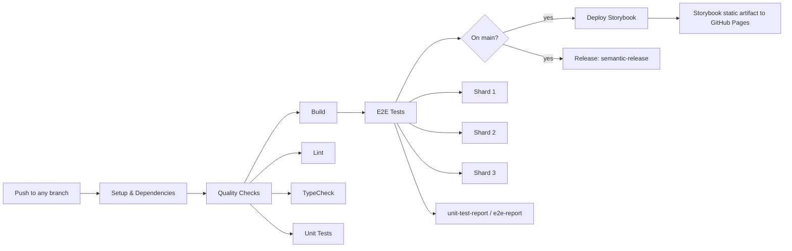

# CI/CD Pipeline Documentation

## Overview

This document describes the CI/CD pipeline architecture for the Wallarm Design System monorepo, implemented using GitHub Actions, Docker, and modern DevOps practices.

## 🏗️ Pipeline Architecture

### Environment Requirements

- **Node.js**: v24+
- **pnpm**: 10.33.2
- **Docker**: Latest stable version
- **GitHub Actions**: Ubuntu latest runner

### Pipeline Stages

`check-pr-title` runs in a **separate** workflow ([`pr-title.yml`](../.github/workflows/pr-title.yml)), triggered on `pull_request`. Everything below runs in [`main.yml`](../.github/workflows/main.yml), triggered on `push` to any branch:


```mermaid
flowchart LR
    A[Push to any branch] --> C[Setup & Dependencies]
    C --> D[Quality Checks]
    D --> E[Build]
    E --> F[E2E Tests]
    F --> R{On main?}
    R -->|yes| G[Deploy Storybook]
    R -->|yes| S[Release: semantic-release]

    D --> D1[Lint]
    D --> D2[TypeCheck]
    D --> D3[Unit Tests]

    F --> F1[Shard 1]
    F --> F2[Shard 2]
    F --> F3[Shard 3]
    F --> F4[unit-test-report / e2e-report]

    G --> G1[Storybook static artifact to GitHub Pages]
```

## 📋 Pipeline Jobs

### 1. PR Title Check (`check-pr-title`)

Validates that PR titles follow conventional commit format. Lives in its own workflow file, [`pr-title.yml`](../.github/workflows/pr-title.yml) — it is **not** a job inside `main.yml` and does not gate or block the jobs below.

**Triggers**: Pull request creation/update (`opened`, `edited`, `synchronize`, `reopened`) targeting `main`
**Requirements**: Conventional commit format
**Tools**: `thehanimo/pr-title-checker`

### 2. Setup (`setup`)

Manages dependencies and caching for optimal performance.

**Key Features**:

- Node.js v24 setup
- pnpm v10.33.2 with caching
- Dependency installation with frozen lockfile
- Screenshot update detection

**Cache Strategy**:

- Cache key: `pnpm-store-${{ hashFiles('**/pnpm-lock.yaml') }}`
- Restore keys for fallback
- Turbo cache optimization

### 3. Quality Checks (`quality`)

Parallel execution of code quality validations.

**Parallel Jobs**:

- **Lint**: ESLint validation across all packages
- **TypeCheck**: TypeScript strict mode checking
- **Unit Tests**: Vitest test execution with coverage

**Performance**: ~2-3 minutes total (parallel execution)

### 4. Build (`build`)

Builds all workspace packages and the Storybook static site. **No Docker image is built or pushed here** — output is uploaded as plain GitHub Actions artifacts (`storybook-static`, `built-packages`) for downstream jobs to consume.

**Build Steps**:

- `pnpm build` — builds all packages
- `pnpm --filter=@wallarm-org/design-system build-storybook` — builds the static Storybook site
- Uploads both as `actions/upload-artifact`

The `Dockerfile`s under `packages/design-system/` and `apps/playground/` exist for manual/local builds (see the root `README.md`'s Docker section) and are unrelated to this job.

### 5. E2E Tests (`e2e`)

Sharded testing for optimal performance.

**Configuration**:

```yaml
shard: [1, 2, 3]
browser: chromium
```

**Total Jobs**: 3 parallel E2E test shards

**Features**:

- Runs inside the public `mcr.microsoft.com/playwright` container (not a project-built image) so Playwright's browser binaries are pre-installed
- Readiness check: a plain `curl` retry loop polls the Storybook static server until it responds — not a GitHub Actions `services:`-based Docker health check
- Artifact upload for test results
- Screenshot comparison

### 6. Test Reporting (`unit-test-report`, `e2e-report`)

Publishes JUnit test results from the `quality` and `e2e` jobs as GitHub Actions check annotations (via `dorny/test-reporter`).

### 7. Screenshot Updates (`e2e-update-screenshots`, `commit-screenshots`)

Automated visual regression baseline updates, split across two jobs.

**Triggers**:

- Push to main branch with `[update-screenshots]` in commit message
- Manual workflow dispatch

**Process**:

1. `e2e-update-screenshots` (sharded 3-way) runs tests with `--update-snapshots`
2. `commit-screenshots` merges the shard outputs, commits updated screenshots, and pushes back to the branch

### 8. Deploy (`deploy-storybook`)

Production deployment to GitHub Pages.

- **Target**: GitHub Pages
- **URL**: https://wallarm.github.io/wallarm-design-system/
- **Triggers**: Push to main branch
- **Process**:
  1. Download the `storybook-static` artifact produced by the `build` job (no Docker image involved)
  2. Upload to GitHub Pages artifact
  3. Deploy using `actions/deploy-pages`

### 9. Release (`release`)

Runs `semantic-release` for `@wallarm-org/design-system` and, conditionally, `@wallarm-org/mcp` — analyzes commits since the last release, publishes to npm with `NPM_TOKEN`, creates a GitHub release, and (on `feature/*`/`fix/*` branches) publishes an RC-tagged prerelease. See [RELEASE.md](./RELEASE.md) for the full branch strategy.

## 🔧 Configuration Files

### Main Workflow (`.github/workflows/main.yml`)

```yaml
name: CI/CD Pipeline
on:
  push:
    branches: ['**']

  workflow_dispatch:

env:
  NODE_VERSION: '24'
  PNPM_VERSION: '10.33.2'
```

`main.yml` has no `pull_request` trigger — that belongs to the separate `pr-title.yml` workflow (see job 1 above).

### Docker Configuration

`packages/design-system/Dockerfile` and `apps/playground/Dockerfile` exist for **manual/local** builds and `docker-compose.local.yml` — CI does not build, run, or push either image. See the root `README.md`'s Docker section for local usage.

```dockerfile
FROM node:24-alpine AS base
# Multi-stage build:
# 1. deps: Install dependencies
# 2. builder: Build Storybook
# 3. production: Serve with nginx
```

## 🚀 Optimization Strategies

### 1. Caching Strategy

- **pnpm Store**: Cached based on lockfile hash, via both `actions/setup-node`'s built-in `cache: 'pnpm'` and a separate hand-rolled `node_modules` cache in each job that installs dependencies — these overlap and are a known consolidation opportunity
- **Turbo Cache**: Incremental build caching
- **Browser Binary Cache**: Playwright browsers pre-installed in the `mcr.microsoft.com/playwright` container image used by `e2e`/`e2e-update-screenshots`

### 2. Parallelization

- Quality checks run in parallel (lint, typecheck, test)
- E2E tests use sharding (3 parallel shards)
- Optimized for single service focus

### 3. Conditional Execution

- E2E skip for merge commits to main
- `[skip-e2e]` flag support
- Deploy only on main branch

### 4. Resource Optimization

- Docker multi-stage builds
- Minimal production images
- Selective workspace installation
- Frozen lockfile for reproducibility

## 📊 Performance Metrics

### Target Timings

| Stage          | Target  | Current   |
| -------------- | ------- | --------- |
| PR Check       | < 30s   | ✅ 20s    |
| Setup          | < 2min  | ✅ 1.5min |
| Quality        | < 3min  | ✅ 2.5min |
| Build          | < 5min  | ✅ 4min   |
| E2E Tests      | < 10min | ✅ 8min   |
| Total Pipeline | < 15min | ✅ 12min  |

### Success Metrics

- **Build Success Rate**: > 95%
- **Test Flakiness**: < 2%
- **Cache Hit Rate**: > 80%
- **Deployment Success**: > 99%

## 🔒 Security

### Secret Management

Required GitHub Secrets:

- `GITHUB_TOKEN`: Auto-provided by GitHub Actions
- `NPM_TOKEN`: Required by the `release` job to publish `@wallarm-org/design-system` and `@wallarm-org/mcp` to npm

There is no container registry push in this pipeline, so no registry credential is needed.

### Security Scanning

No automated security scanning currently runs in CI — no dependency-vulnerability check (e.g. `pnpm audit`), no CodeQL/SAST, no Docker image scanning, and no secret-detection step are configured in `main.yml` or `pr-title.yml`. `pnpm audit --prod` can be run manually/locally in the meantime. This is a gap worth closing (e.g. a scheduled `pnpm audit` job or Dependabot), not a currently-implemented feature.

## 🐛 Debugging

### Common Issues

#### Cache Issues

```bash
# Clear cache by updating cache key version
CACHE_VERSION: "v2"  # Increment this
```

#### E2E Test Failures

```bash
# Run locally with same config
pnpm e2e:docker

# Debug specific browser
pnpm e2e:docker --project=chromium
```

#### Docker Build Failures

```bash
# Build locally to debug
docker build -f packages/design-system/Dockerfile .
```

### Debugging Commands

```bash
# View workflow logs
gh run list --limit 5
gh run view <run-id>

# Download artifacts
gh run download <run-id>

# Re-run failed jobs
gh run rerun <run-id> --failed
```

## 📈 Monitoring

### Key Metrics to Track

1. **Pipeline Duration**: Track trends over time
2. **Failure Rate**: Identify problematic stages
3. **Resource Usage**: Optimize runner specifications
4. **Cache Effectiveness**: Monitor hit rates

### Recommended Tools

- GitHub Actions Analytics
- Third-party monitoring (Datadog, New Relic)
- Custom dashboards with GitHub API
- Slack/Discord notifications

## 🔄 Continuous Improvement

### Regular Reviews

- **Weekly**: Review failed builds
- **Monthly**: Analyze performance metrics
- **Quarterly**: Optimize pipeline architecture

### Optimization Opportunities

1. **Dynamic Test Splitting**: Distribute tests based on duration
2. **Incremental Builds**: Build only changed packages
3. **Smart E2E Selection**: Run relevant tests based on changes
4. **Progressive Deployment**: Canary releases for production
5. **Consolidate caching**: Drop the redundant hand-rolled `node_modules` cache in favor of `actions/setup-node`'s built-in `pnpm` cache alone
6. **Add `timeout-minutes`**: No job currently has an explicit timeout, so a hung step can run to GitHub's 360-minute default cap

## 📚 References

- [GitHub Actions Documentation](https://docs.github.com/actions)
- [Docker Best Practices](https://docs.docker.com/develop/dev-best-practices/)
- [pnpm Workspace Configuration](https://pnpm.io/workspaces)
- [Turborepo Documentation](https://turbo.build/repo/docs)

## 🆘 Support

For CI/CD issues:

1. Check this documentation
2. Review recent workflow runs
3. Consult team leads
4. Create issue with `ci/cd` label

---

_Last Updated: 2026-07_
_Version: 1.1.0_
