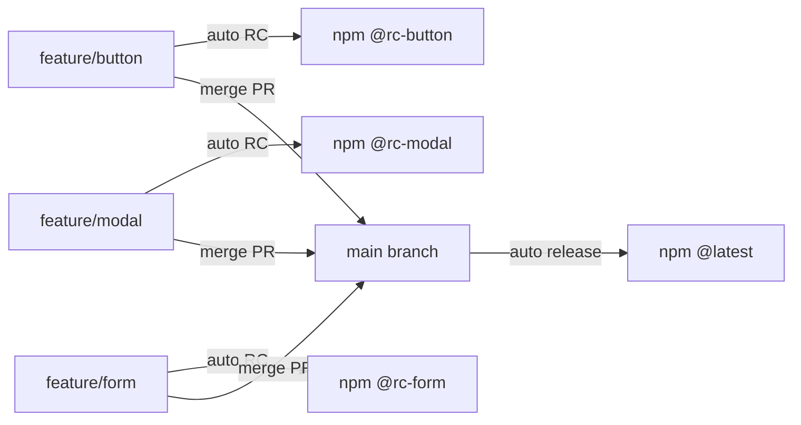

# 🚀 Release Process

This project uses **semantic-release** for fully automated versioning and package publishing.

## Branch Strategy



**Feature-to-Production Flow**:

- `feature/*` branches automatically create RC versions for testing
- `main` branch creates production versions after PR merge

## Automatic Versioning

Version bumps are determined by commit messages following [Conventional Commits](https://www.conventionalcommits.org/):

| Commit Type                                       | Release Type | Version Change    | Example                         |
| ------------------------------------------------- | ------------ | ----------------- | ------------------------------- |
| `fix:`                                            | Patch        | `1.0.0` → `1.0.1` | `fix: correct button alignment` |
| `feat:`                                           | Minor        | `1.0.0` → `1.1.0` | `feat: add new Modal component` |
| `feat!:` or `BREAKING CHANGE:`                    | Major        | `1.0.0` → `2.0.0` | `feat!: redesign API structure` |
| `docs:`, `style:`, `refactor:`, `test:`, `chore:` | No release   | -                 | `docs: update README`           |

## Screenshot Updates

### Automatic Screenshot Updates

To update visual regression test screenshots in CI:

1. **Add trigger to commit message**:

   ```bash
   git commit -m "feat: update button styles [update-screenshots]"
   git push
   ```

2. **CI automatically**:
   - Runs tests with `--update-snapshots` flag
   - Commits updated screenshots
   - Pushes changes back to branch

3. **Protection against loops**:
   - Bot commits are ignored by CI
   - Special commit message prevents re-triggering

### Manual Screenshot Updates

For local updates:

```bash
# Using Docker (recommended)
pnpm e2e:docker:update:ui

# Without Docker
pnpm --filter=@wallarm-org/design-system test:e2e --update-snapshots
```

## Development Workflow

### 1. Create Feature Branch

```bash
# Always branch from main
git checkout -b feature/awesome-button main

# Feature branch naming convention:
# feature/component-name
# feature/issue-123
# feature/add-dark-mode
```

### 2. Develop with Conventional Commits

```bash
git add .
git commit -m "feat: add new button variant"
git commit -m "fix: resolve hover state issue"
git commit -m "docs: update button examples"
```

### 3. Push to Get RC Version

```bash
# Push to feature branch
git push origin feature/awesome-button

# Automatically creates RC version:
# 1.0.0-rc.awesome-button.1
# Published to npm with tag: rc-awesome-button
```

### 4. Test RC Version

```bash
# Install specific feature RC
npm install @wallarm-org/design-system@rc-awesome-button

# View all available RC versions
npm view @wallarm-org/design-system dist-tags

# Test in your application
# Share with QA team for testing
```

### 5. Create Pull Request

```bash
# Create PR to main branch
# PR title should follow conventional commit format
# Example: "feat: add awesome button component"
```

### 6. Production Release (Automatic)

```bash
# When PR is approved and merged to main:
# 1. Analyzes all commits from PR
# 2. Determines version bump (major/minor/patch)
# 3. Creates production version (e.g., 1.1.0)
# 4. Publishes to npm with @latest tag
# 5. Creates GitHub release
# 6. Deploys Storybook to GitHub Pages
```

## Installation

### Production Version

```bash
# Latest stable version from main branch
npm install @wallarm-org/design-system
```

### Feature RC Versions

```bash
# Install specific feature RC
npm install @wallarm-org/design-system@rc-button
npm install @wallarm-org/design-system@rc-modal
npm install @wallarm-org/design-system@rc-dark-mode

# List all RC versions
npm view @wallarm-org/design-system dist-tags | grep rc-
```

## Version Examples

| Branch              | Version Format         | npm Install Command                               |
| ------------------- | ---------------------- | ------------------------------------------------- |
| `main`              | `1.0.0`                | `npm install @wallarm-org/design-system`              |
| `feature/button`    | `1.0.0-rc.button.1`    | `npm install @wallarm-org/design-system@rc-button`    |
| `feature/modal`     | `1.0.0-rc.modal.1`     | `npm install @wallarm-org/design-system@rc-modal`     |
| `feature/issue-123` | `1.0.0-rc.issue-123.1` | `npm install @wallarm-org/design-system@rc-issue-123` |

## What Happens Automatically

### On push to `feature/*`:

1. **Quality Checks** - Runs lint, typecheck, and tests
2. **Build** - Builds all packages
3. **Version Analysis** - Determines next RC version
4. **RC Creation** - Creates version like `1.0.0-rc.feature-name.1`
5. **NPM Publish** - Publishes with tag `rc-feature-name`
6. **Changelog Update** - Updates CHANGELOG.md

### On merge to `main`:

1. **Quality Checks** - Runs lint, typecheck, and tests
2. **Build** - Builds all packages and Storybook
3. **Version Analysis** - Determines version from commits
4. **Production Release** - Creates stable version (e.g., `1.0.0`)
5. **NPM Publish** - Publishes with `latest` tag
6. **GitHub Release** - Creates release with notes
7. **Storybook Deploy** - Deploys to GitHub Pages
8. **Changelog Update** - Updates CHANGELOG.md

## Managing RC Versions

### View All RC Versions

```bash
# List all dist-tags
npm view @wallarm-org/design-system dist-tags

# Filter RC versions only
npm view @wallarm-org/design-system dist-tags | grep "rc-"
```

### Clean Up Old RC Versions

```bash
# RC versions are automatically deprecated after merge
# Manual cleanup (if needed):
npm deprecate @wallarm-org/design-system@1.0.0-rc.old-feature.1 "Feature merged to main"
```

### Testing Multiple RCs

```bash
# Install different RCs in different projects
cd project-a && npm install @wallarm-org/design-system@rc-button
cd project-b && npm install @wallarm-org/design-system@rc-modal

# Or use npm aliases
npm install button-rc@npm:@wallarm-org/design-system@rc-button
npm install modal-rc@npm:@wallarm-org/design-system@rc-modal
```

## Requirements

### GitHub Configuration

- **NPM_TOKEN**: Required secret for npm publishing
- **Branch Protection** for `main`:
  - Require pull request reviews
  - Require status checks to pass
  - Require branches to be up to date

### Naming Conventions

- Feature branches: `feature/descriptive-name`
- Use lowercase and hyphens
- Keep names short but descriptive
- Examples:
  - ✅ `feature/dark-mode`
  - ✅ `feature/button-variants`
  - ✅ `feature/issue-123`
  - ❌ `feature/my_awesome_feature`
  - ❌ `myfeature`

## Best Practices

### For Feature Development

1. **One feature per branch** - Keep PRs focused
2. **Descriptive branch names** - Used in RC version identifier
3. **Test RC thoroughly** - Before creating PR to main
4. **Clean commits** - Use conventional commit format
5. **Update from main regularly** - Keep feature branch current

### For Testing

1. **Share RC versions** - Send install command to QA team
2. **Test in real environment** - Use RC in actual projects
3. **Document issues** - Report problems before merge
4. **Verify before merge** - Ensure RC works as expected

## Troubleshooting

### RC Version Not Created

- Verify branch name starts with `feature/`
- Check GitHub Actions for errors
- Ensure NPM_TOKEN is configured

### Can't Install RC Version

- Check exact tag name: `npm view @wallarm-org/design-system dist-tags`
- Use full version if tag doesn't work: `@1.0.0-rc.button.1`

### Multiple Features with Same Version

- Each feature gets unique identifier from branch name
- Versions like `rc.button.1` and `rc.modal.1` are different

## Examples

### Complete Feature Flow

```bash
# 1. Start feature
git checkout -b feature/date-picker main

# 2. Develop
git commit -m "feat: add date picker component"
git commit -m "test: add date picker tests"
git commit -m "docs: add date picker examples"

# 3. Push for RC
git push origin feature/date-picker
# Creates: 1.0.0-rc.date-picker.1

# 4. Test RC
npm install @wallarm-org/design-system@rc-date-picker

# 5. Fix issues
git commit -m "fix: timezone handling"
git push
# Creates: 1.0.0-rc.date-picker.2

# 6. Create PR
# Title: "feat: add date picker component"

# 7. Merge → Automatic production release
# Creates: 1.1.0 (minor bump for feature)
```

### Parallel Feature Development

```bash
# Team member A
git checkout -b feature/calendar main
git push # → 1.0.0-rc.calendar.1

# Team member B
git checkout -b feature/tooltip main
git push # → 1.0.0-rc.tooltip.1

# Both can be tested independently
npm install @wallarm-org/design-system@rc-calendar  # Team A's work
npm install @wallarm-org/design-system@rc-tooltip   # Team B's work

# Merge when ready (in any order)
```
